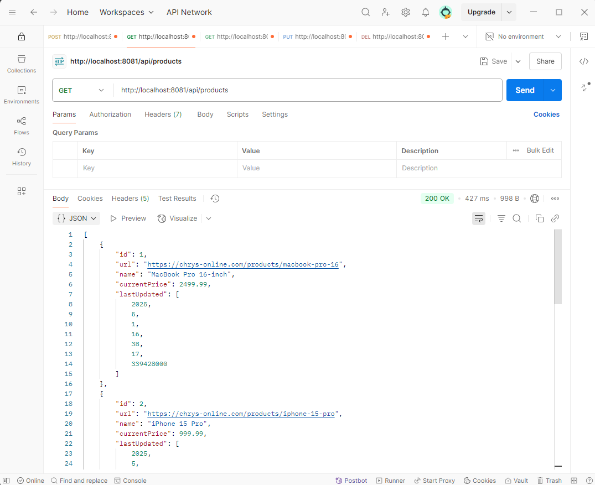
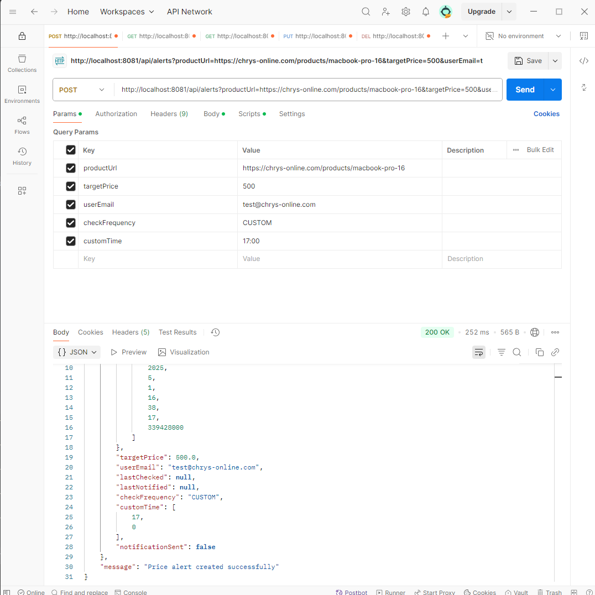
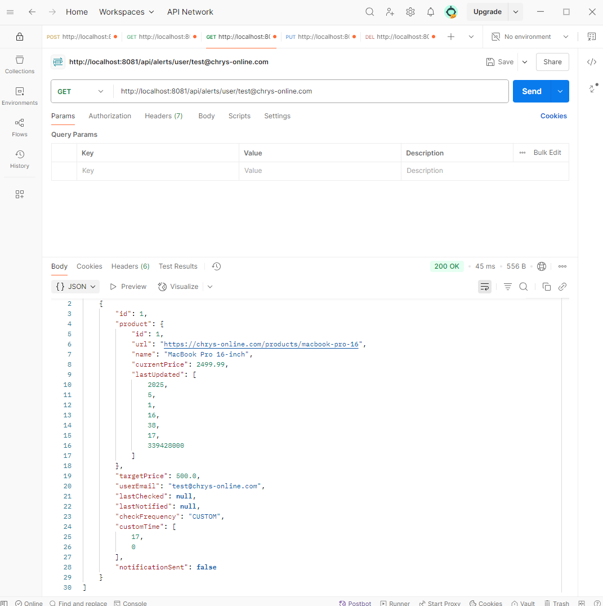
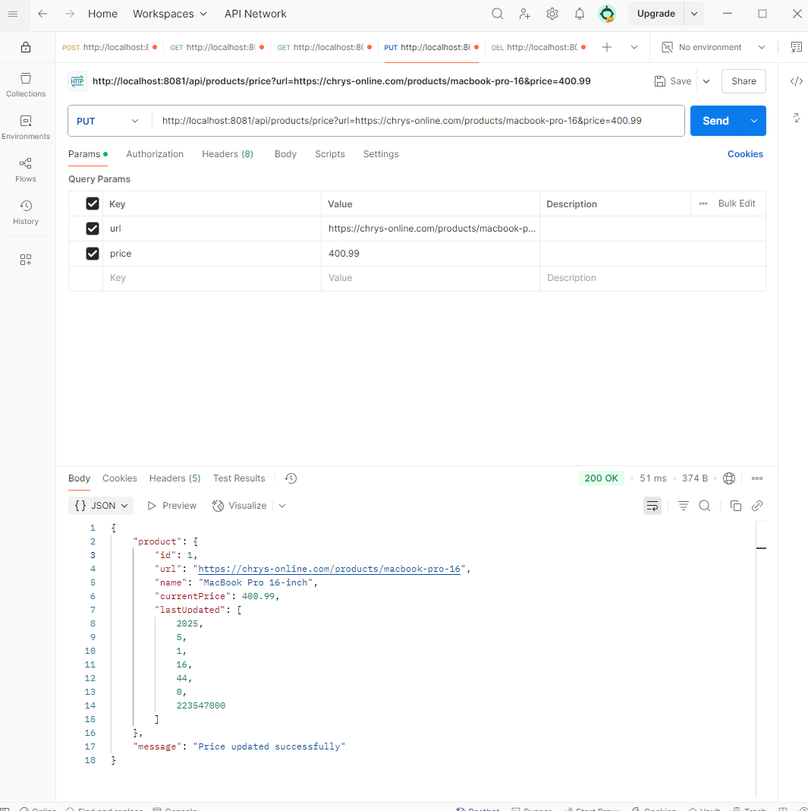
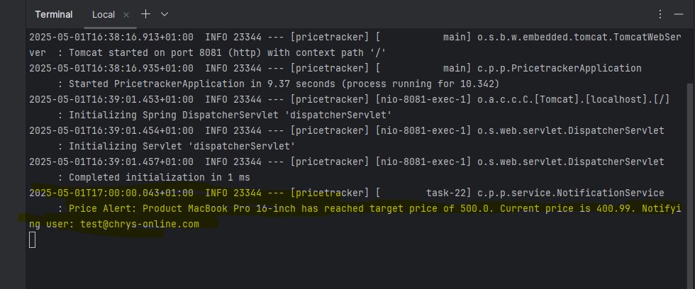
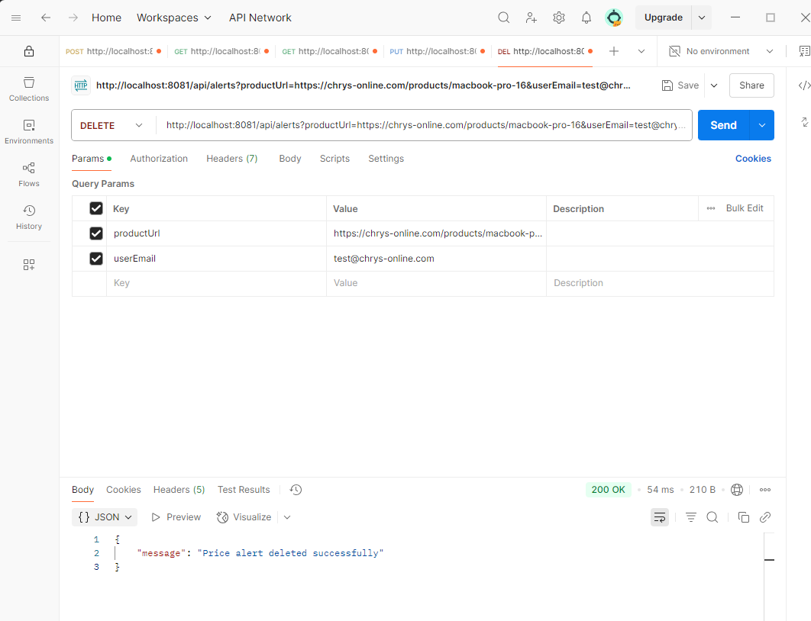
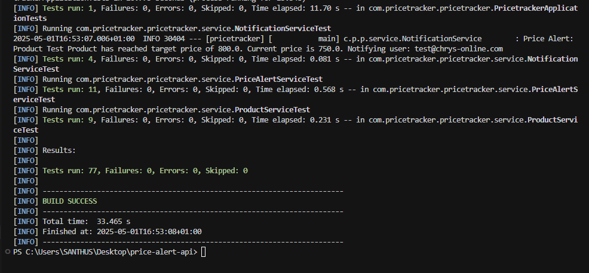

# Testing Guide

[← Back to README](README.md)

This guide provides step-by-step instructions for testing the Price Alert Tracking System using Postman.

## Prerequisites

1. Install [Postman](https://www.postman.com/downloads/)
2. Ensure the application is running locally on port 8081
3. Have Postman open and ready to use

## Test Steps

### 1. View All Products
**Endpoint:** `GET http://localhost:8081/api/products`

Steps:
1. Open Postman
2. Create a new GET request
3. Enter the URL: `http://localhost:8081/api/products`
4. Click "Send"
5. Verify that all products from `products.json` are returned



### 2. Create Price Alert
**Endpoint:** `POST http://localhost:8081/api/alerts`

Steps:
1. Create a new POST request
2. Enter the URL: `http://localhost:8081/api/alerts`
3. Add query parameters:
   - `productUrl`: `https://chrys-online.com/products/macbook-pro-16`
   - `targetPrice`: `500`
   - `userEmail`: `test@chrys-online.com`
   - `checkFrequency`: `CUSTOM`
   - `customTime`: `17:00`
4. Click "Send"
5. Verify the success response



### 3. Verify Alert Creation
**Endpoint:** `GET http://localhost:8081/api/alerts/user/test@chrys-online.com`

Steps:
1. Create a new GET request
2. Enter the URL: `http://localhost:8081/api/alerts/user/test@chrys-online.com`
3. Click "Send"
4. Verify that the created alert is in the response



### 4. Update Product Price
**Endpoint:** `PUT http://localhost:8081/api/products/price`

Steps:
1. Create a new PUT request
2. Enter the URL: `http://localhost:8081/api/products/price`
3. Add query parameters:
   - `url`: `https://chrys-online.com/products/macbook-pro-16`
   - `price`: `400.99`
4. Click "Send"
5. Verify the price update response



### 5. Observe Notification
Steps:
1. Wait until the custom time (10:30) is reached
2. Check the console logs for the notification message
3. Verify that the notification contains:
   - Product name
   - Target price
   - Current price
   - User email



### 6. Delete Price Alert
**Endpoint:** `DELETE http://localhost:8081/api/alerts`

Steps:
1. Create a new DELETE request
2. Enter the URL: `http://localhost:8081/api/alerts`
3. Add query parameters:
   - `productUrl`: `https://chrys-online.com/products/macbook-pro-16`
   - `userEmail`: `test@chrys-online.com`
4. Click "Send"
5. Verify the deletion response



## Automated Test Results

To run the automated tests, use the following command:

```bash
# Windows
mvn test

# Mac
mvn test
```

Below are the test results:



## Validation Testing

### Price Validations
1. Try updating product price with:
   - Negative value
   - Zero value
   - Value less than 1
   - Non-numeric value
2. Try creating alert with:
   - Target price higher than current price
   - Target price less than 1
   - Target price equal to current price

### Email Validations
1. Try creating alert with:
   - Invalid email format
   - Missing email
   - Empty email string

### Frequency Validations
1. Try creating alert with:
   - Invalid frequency value
   - CUSTOM frequency without customTime
   - Invalid customTime format

## Expected Error Messages

1. Price Validation Errors:
   - "Price must be greater than or equal to 1"
   - "Target price must be less than current price"
   - "Price must be a valid number"

2. Email Validation Errors:
   - "Invalid email format"

3. Frequency Validation Errors:
   - "Invalid check frequency"
   - "Custom time is required when CUSTOM frequency is selected"
   - "Invalid custom time format"
 
[← Back to README](README.md) 